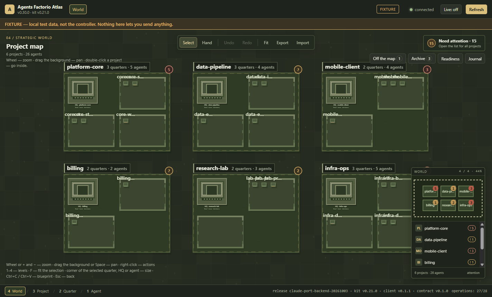
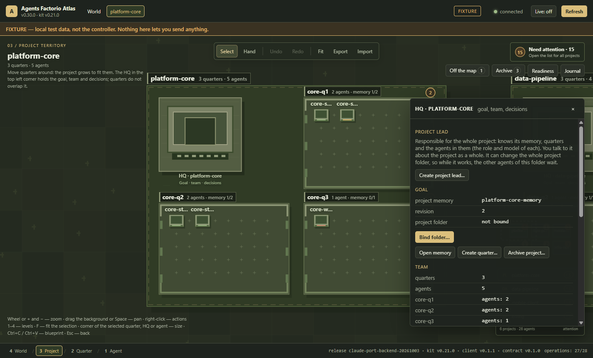
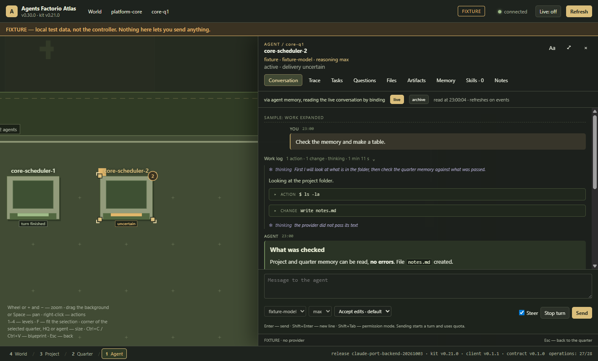

# Agents Factorio

**A local-first control room for teams of Claude Code agents.** Agents Factorio
runs many [Claude Code](https://docs.anthropic.com/en/docs/claude-code) agents
(through the Claude Agent SDK) side by side on your own machine, gives each one
a project, a role, a memory and a write zone, and shows the whole team on a
strategy-game map - **World → Project → Quarter → Agent** - with live chats,
attention badges and per-turn git history.

It is a multi-agent orchestration system for AI coding agents: an Application
Gateway that hosts the agent sessions, a controller that hands out tasks with
verifiable, hash-bound contracts, and **Atlas**, an Electron desktop app to
watch, steer and approve what the agents do.

If you are looking for a **multi-agent orchestrator for Claude Code**, a
**desktop app to run several Claude Code agents in parallel**, **persistent
memory for Claude Code agents**, a way to **limit which files an AI coding
agent may edit**, or a **local, self-hosted control room built on the Claude
Agent SDK** - this is what Agents Factorio does.

> **Status: working alpha, under active development.** It is the tool its
> author works with every day, so new features and fixes keep landing here -
> see the [roadmap](#roadmap) and [CHANGELOG.md](CHANGELOG.md).
> Windows-first (PowerShell tools); Node.js 20+. Not affiliated with Anthropic
> or with Wube Software.



| A project and its HQ: goal, team, the project lead | An agent's chat: work log, thinking, tool calls, steering |
| --- | --- |
|  |  |

<sub>Screenshots from Atlas's built-in fixture data (`frontend\start-atlas-fixture.bat`).</sub>

## Useful for

- running a team of Claude Code agents across several repositories at once;
- giving each AI coding agent a role, a memory and a write zone;
- watching and steering agents live: chat, thinking, tool calls, questions;
- reviewing exactly what each agent changed: one git commit per turn;
- handing out tasks to agents with verifiable, hash-bound contracts.

## Why

One coding agent in a terminal is easy to follow. Five agents across three
repositories are not: who is working, who is waiting for an answer, who changed
which files, what each of them was told, and what it may touch. Agents Factorio
makes that visible and enforceable:

- **See the team at a glance.** Projects are territories, quarters (features)
  are districts, agents are units with a status frame ("working", "turn
  finished", "waiting for your answer"); attention badges follow you from the
  world view down to a single agent.
- **Give agents memory that survives sessions.** Project, quarter and per-agent
  memory is stored by the backend and delivered with each turn only when it
  changed. Agents propose memory as documents; nothing enters memory without
  the person approving the exact text (by its SHA-256).
- **Keep agents in their lane.** Write zones per agent (`tools/solver/**`),
  project and quarter leads with matching rights, Claude Code permission modes
  per agent (manual, accept edits, auto, bypass), and a pre-tool hook that
  refuses edits outside the zone.
- **Know what changed.** Every turn that changed files becomes a git commit by
  that agent - only that turn's files, inside its zone - so the history of the
  agents' work is a `git log --author=<agent>` away.
- **Talk to agents like in Claude Code.** Live chat with thinking blocks,
  tool calls, questions with options (single and multiple choice), steering a
  running turn or queueing for its end, model and effort per agent, plan usage
  (5-hour session, week, per-model limits).
- **Hand out work that can be checked.** Controller tasks are immutable,
  hash-bound packets: accepted, planned, reported and accepted again by code,
  not by the agent saying it is done.

## How it works

```
 Atlas (Electron desktop app)                 your projects' folders
   map · chats · memory · approvals              (git, write zones)
          │  loopback HTTP + event stream                ▲
          ▼                                              │ Claude Code tools
 Application Gateway  ── Claude Agent SDK sessions ──────┘
   operations · receipts · attention · usage meter
          │
          ▼
 Controller: memory store (SQLite), agent catalog, task contracts, journals
```

- **Application Gateway** (`backend/orchestrator/src`, built into one bundle
  with no runtime npm dependencies): one local process that
  hosts every agent as a Claude Code session, exposes typed operations (send,
  steer, interrupt, read the conversation, memory, files, tasks) over a
  loopback-only HTTP API with a bearer token that never leaves the machine, and
  records an operation journal. Every write has an identity and a receipt; an
  uncertain outcome is reconciled, never blindly resent.
- **Controller** (`controller/`): the instance the Gateway works for - the
  memory store, the agent catalog, project folder bindings, task packets and
  reports, PowerShell tools to start, stop and inspect the Gateway.
- **Atlas** (`frontend/`): the desktop window. It loads only a frontend kit
  release the backend accepted (verified by hashes), never reads credentials,
  and asks for confirmation before anything irreversible.

## Quick start (Windows)

Requirements: Windows 10/11, Windows PowerShell 5.1, Node.js 20+ (22
recommended), Python 3 (its `sqlite3` module holds the memory database), Git,
and Claude Code signed in on this machine (`claude auth status`).

```powershell
git clone https://github.com/AlexKhutor/agents-factorio.git
cd agents-factorio

# 1. Atlas and the Claude Agent SDK it ships.
cd frontend; npm install; cd ..

# Try the UI first, on built-in fixture data (no controller, no model calls):
#   frontend\start-atlas-fixture.bat

# 2. A controller instance of your own: it holds the memory database,
#    task packets and reports. Keep it outside the repository.
Copy-Item -Recurse .\controller C:\agents-control
cd C:\agents-control
New-Item -ItemType Directory -Force .project-local\application-gateway, .project-local\orchestration
Copy-Item config\claude-provider.example.json .project-local\application-gateway\claude-provider.json
Copy-Item config\control-cycle.example.json .project-local\orchestration\control-cycle.json
#    In claude-provider.json set sdkPath to <repo>/frontend/node_modules/@anthropic-ai/claude-agent-sdk

# 3. Start the Application Gateway (redirect its output to a file, do not pipe it).
powershell -NoProfile -ExecutionPolicy Bypass -File tools\application_gateway.ps1 `
  -Command Start -RepoRoot C:\agents-control -Provider claude -AsJson > logs\gateway-start.json

# 4. Point Atlas to it: copy frontend\config\local.example.json to local.json,
#    set controllerRoot and expectedWorkspace (from the controller's
#    .project-local\application-gateway\status.v1.json), then:
<repo>\frontend\start-atlas.bat
```

The controller's own [README](controller/README.md) covers desk agents, the
coordinator and task contracts; [claude-code-provider.md](backend/orchestrator/docs/claude-code-provider.md)
covers models, permission modes and the SDK settings.

## Repository layout

| Path | What |
| --- | --- |
| `backend/orchestrator/src` | Application Gateway, memory service, Claude Code session host, write zones, task tools |
| `backend/orchestrator/test` | Backend test suites (`node --test`) |
| `backend/orchestrator/docs` | Guides: architecture, Claude Code provider, project memory, attention, security |
| `backend/tools` | PowerShell tools for the Gateway's lifecycle |
| `controller/` | The controller instance template to copy |
| `frontend/` | Atlas, the Electron desktop app, and its tests |

## Security and privacy

- Everything runs locally. The Gateway listens on loopback only; its bearer
  token stays in the controller's machine-local folder.
- Atlas never reads Claude credentials; it checks the sign-in with the
  read-only `claude auth status`.
- Irreversible actions (archiving, folder binding, memory writes, "bypass"
  permission mode, git init) go through a confirmation of the trusted host.
- Agents' commits are local; nothing is pushed anywhere by the system.

See [SECURITY.md](SECURITY.md).

## Tests

```powershell
cd backend/orchestrator; npm ci; node scripts/run-tests.mjs   # backend suites (dev tools: esbuild, ajv)
cd frontend; npm test                                         # Atlas unit suites
cd frontend; npm run test:ui                                  # Atlas UI scenes (opens windows)
```

No test calls a model: the backend suites use a fake Claude Agent SDK, and
Atlas's suites use fixture data and a fake Gateway.

## Roadmap

Agents Factorio keeps evolving: it is developed together with the work it is
used for, and improvements land here regularly ([CHANGELOG.md](CHANGELOG.md)).
Next: **Codex CLI agents** next to Claude Code ones, **local agents and
harnesses** (DeepSeek-based harnesses, Hermes, Qoder and other local
solutions), desk agents managed from Atlas, and a faster first run. Later: a
**VR cockpit** - the agent map and chats in a headset, with a PlayStation VR2
and SteamVR prototype from earlier research. The full list is in
[ROADMAP.md](ROADMAP.md); ideas and bug reports are welcome in
[Issues](https://github.com/AlexKhutor/agents-factorio/issues).

## License

GNU Affero General Public License v3.0 only (AGPL-3.0-only), with an
additional permission to combine the program with the Claude Agent SDK - see
[NOTICE.md](NOTICE.md) and [LICENSE](LICENSE). Third-party components keep
their own licenses.
